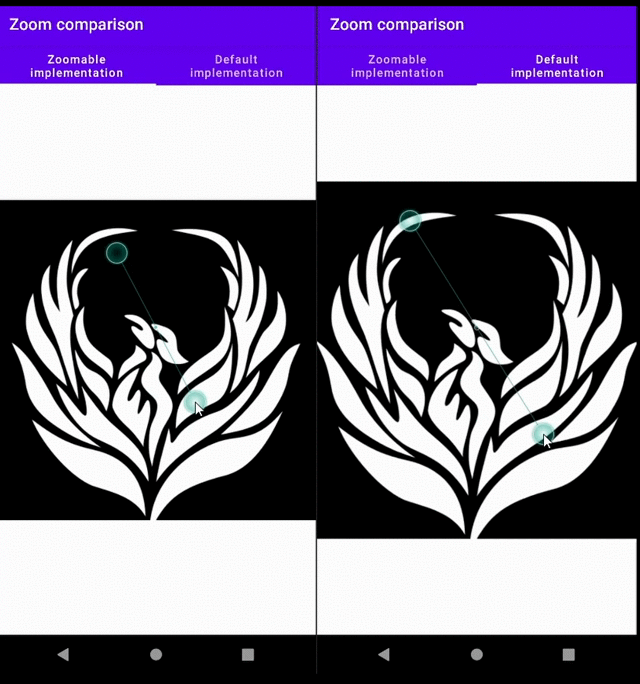

# AndroidUtilityLibraries

A repository for different libraries to make developing an Android app easier

If you have any issues or ideas how to improve any of these libraries feel free to open an [issue](https://github.com/Mr-Pine/AndroidUtilityLibraries/issues/new/choose)

## [Jetpack Compose Zoomables]()

This library provides Composables that handle nice and smooth zooming behaviour for you

